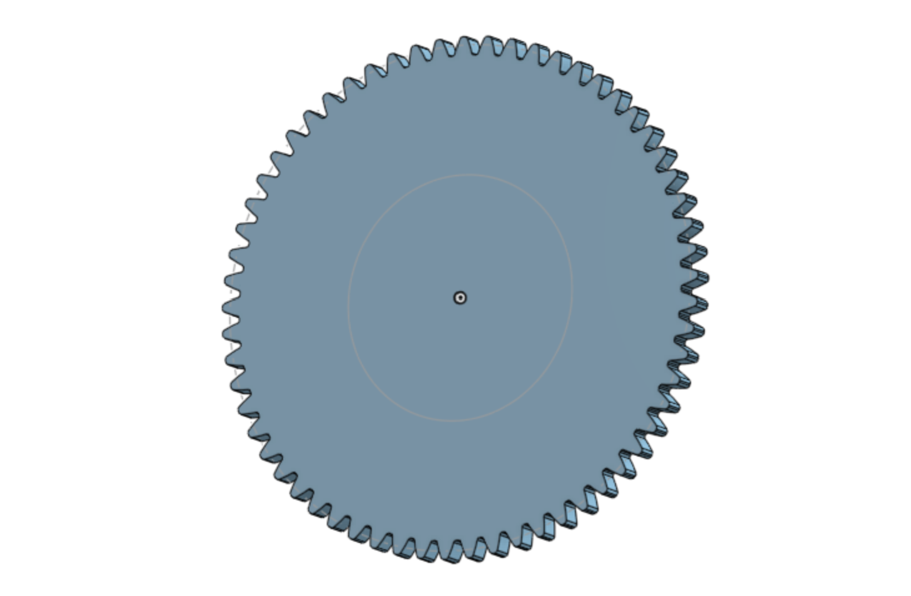
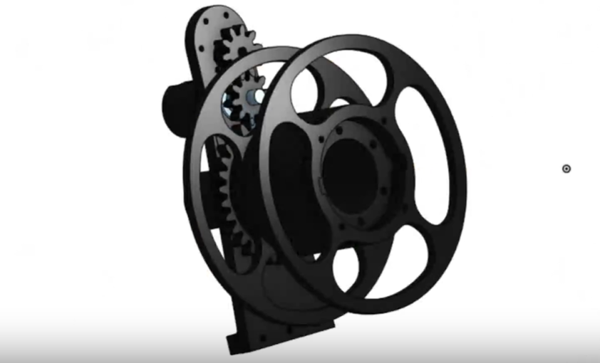
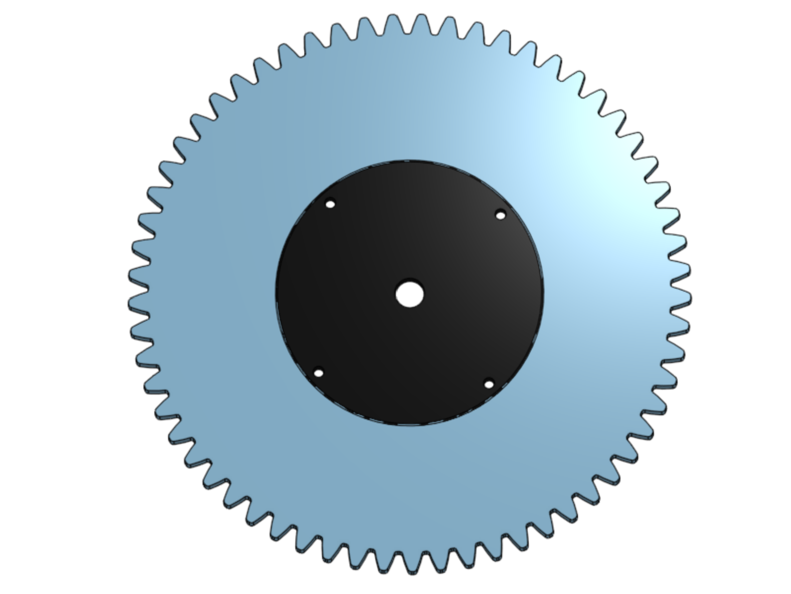
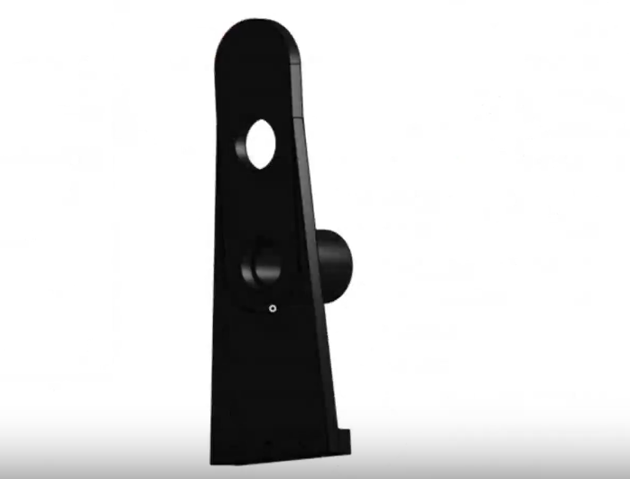
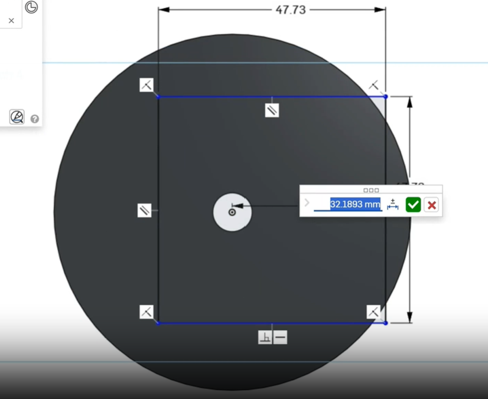
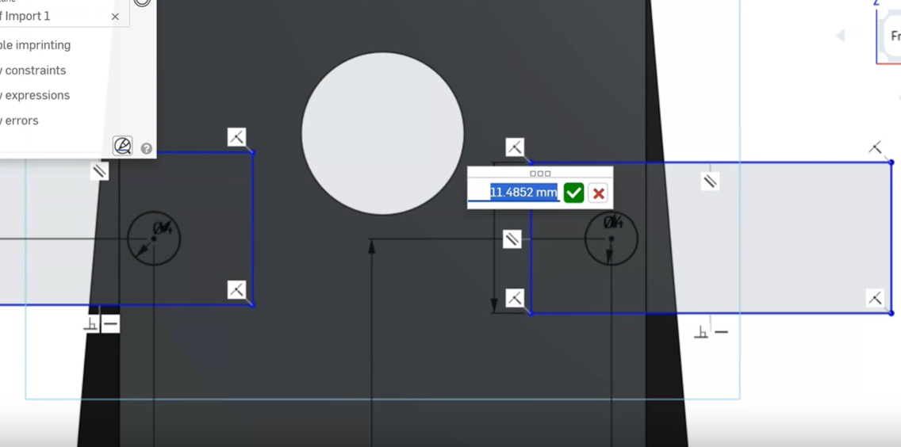
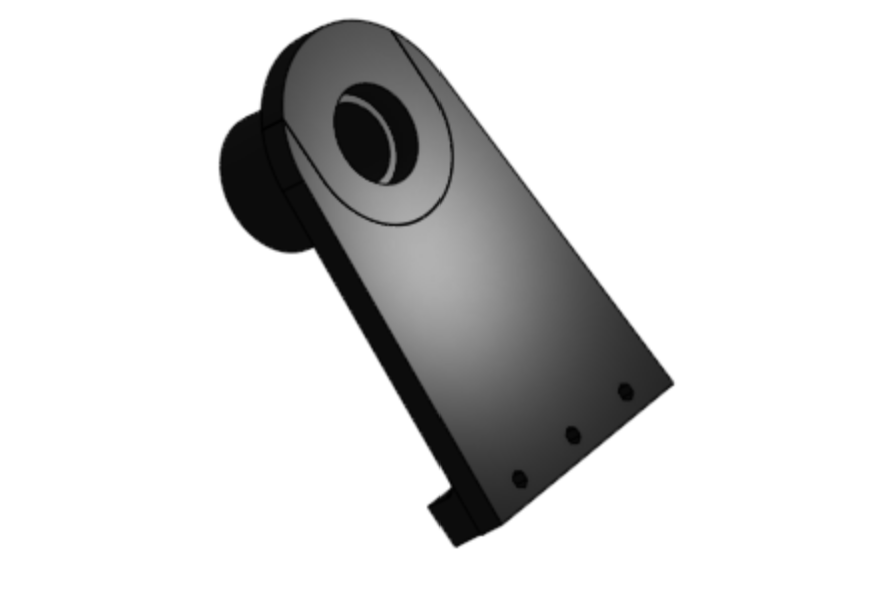
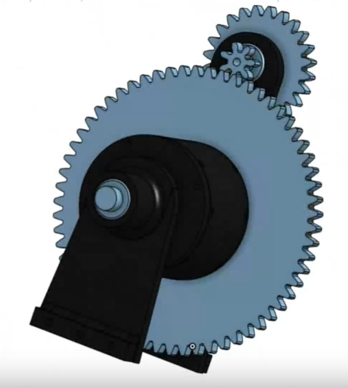
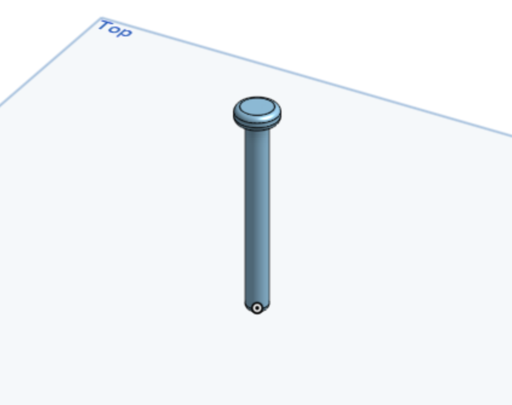
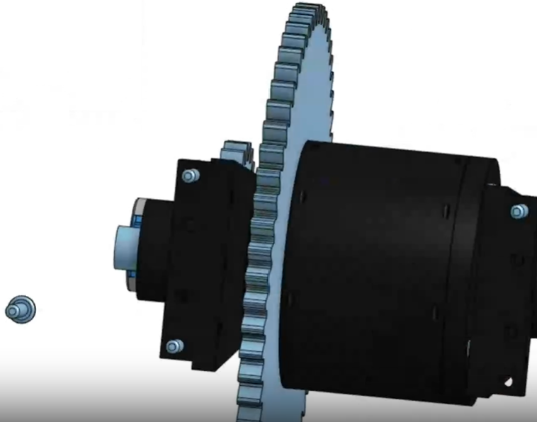

# Devlogs

Hi! Welcome to my project journal! Before you take a peek, you may realize that the commits do not match the logs. That is because this is literally my first time using Github and I didn't really know how to do a journal for devlogs until I was gonna ship :P
If you're a reviewer reviewing my project and you really need proof of the devlogs, I wrote quick summaries under each of my timelapses in Lapse, which is also what my devlogs will be based on. If you need anything from me to clear things up, please let me know in any way. I check Slack very often. Sorry for the inconvenience! Thank you for all your hard work :)

# Devlog 1
1h 0min 27sec Logged

I started working on my Upcycler project today! I need to make a full 3D model as a plan, so I found some files online of a motorized mechanism that pulls the PET in a PET puller. I imported them into my project, but I discovered that they need 608 2RS bearings, M8-1.25 60mm screws, and M8-1.25 hex nuts to be fully put together. I found the dimensions of those parts online and modeled them myself! Afterwards, I brought all the part studios into an assembly and put together the first model of the body (you can find models in branch First-CADS). However, I still need to greatly adapt the puller mechanism to use 28BYJ-48 stepper motors instead of expensive 12V 3RPM DC motors. I started that today by calculating the grams of force per centimeter sqaured of each motor. My motor was approximately 20x weaker than theirs. To compensate for friction, bending of the materials, and the fact that the spool's axle has only one attachment point, I estimated the need for a 30:1 ratio. I modeled the driven gear as large as I could, but my math still does not see my mechansim working. I'll need to improvise a geartrain for everything to work. 

 

# Devlog 2
1h 1min 12sec Logged

I worked on the geartrain for my Upcycler! I finished modeling the big gear to fit the spool and the axle, and I'm getting started on the other gears. I've decided to incorporate four gears: the driver gear will be connected to the 28BYJ-48 stepper motor, the driven gear will be above that (at a 24:7 ratio), and the driven gear will be on the same axle the small gear, which will drive the big gear (at a 61:7 ratio). That should result it a roughly 30:1 ratio. Of course, to fit the new axles and gears, I had to change the body of the puller a lot. I removed the mounting holes meant for the original motor, and I made new slots for new bearings. You can find the files in the 2nd-CADs branch.

 
 

# Devlog 3
1h 4min 57sec Logged

I finished adapting the body of the puller! I added all the necessary bearing slots, I added attachment points for the 28BYJ-48 stepper, and I trimmed a bit off the stud to save filament, save time, and make installment easier. I modeled all three other gears, and I'll put the assembly together soon. however, I decided that I wanted two attachment points for the spool's axle. First, I had to make the other end of the spool capable of taking an axle. I modeled a spool cap by using the same inner ring I used for the big gear. I will be able to add that to the other end of the printed spool. That means I'll need to model a shorter body next, as the second attachment point doesn't need a motor and geartrain, but it does need support. 

# Devlog 4
1h 7min 10sec Logged

First, I modeled the short body. I basically just copied the normal body and cut off the top. I used a circle centered on the axle and tangent to the body's sides to mark the roof. Afterwards, I modeled the legs of the Upcycler. I had to match dimensions I estimated in real life. I'm planning to secure them to the wooden base using #8-32 screws. Finally, I started putting everything together in the assembly again. So much has changed since I did this the first time! I had to redo a bunch of stuff. Everything fits perfectly, as per my calculations! I need to move on to modeling the rest of the Upcycler next: the puller is just one of the biggest parts. You can find the CAD files in the 3rd-CADs branch. 

# Devlog 5
1h 2min 49sec Logged

I grinded out models of all the screws that I'll be using! I couldn't find any #8-32 screw models online that were in parasolid format, so I decided to model them myself! I modeled the #8-32 1.5in, 1in, and 0.75in screws. I also modeled a 1in #6-32 screw. I added them all to the assembly and put them all in place! Afterwards, I added the base to the assembly and added holes to it for the #8-32 screws to secure the legs. Things are really coming together!

