# Devlogs

Hi! Welcome to my project journal! Before you take a peek, you may realize that the commits do not match the logs. That is because this is literally my first time using Github and I didn't really know how to do a journal for devlogs until I was gonna ship :P
If you're a reviewer reviewing my project and you really need proof of the devlogs, I wrote quick summaries under each of my timelapses in Lapse, which is also what my devlogs will be based on. If you need anything from me to clear things up, please let me know in any way. I check Slack very often. Sorry for the inconvenience! Thank you for all your hard work :)

NOTE: If you are checking my project out from Stardance, the reason why I have this Journal.md is because this project was started in Horizons. I had to keep my devlogs here because there was no devlog feature on the website. I stopped updating this journal when I moved over to Stardance, and I wrote the rest of my devlogs there. Thanks for the understanding!

# Devlog 1
1h 0min 27sec Logged

I started working on my Upcycler project today! I need to make a full 3D model as a plan, so I found some files online of a motorized mechanism that pulls the PET in a PET puller. I imported them into my project, but I discovered that they need 608 2RS bearings, M8-1.25 60mm screws, and M8-1.25 hex nuts to be fully put together. I found the dimensions of those parts online and modeled them myself! Afterwards, I brought all the part studios into an assembly and put together the first model of the body (you can find models in branch First-CADS). However, I still need to greatly adapt the puller mechanism to use 28BYJ-48 stepper motors instead of expensive 12V 3RPM DC motors. I started that today by calculating the grams of force per centimeter sqaured of each motor. My motor was approximately 20x weaker than theirs. To compensate for friction, bending of the materials, and the fact that the spool's axle has only one attachment point, I estimated the need for a 30:1 ratio. I modeled the driven gear as large as I could, but my math still does not see my mechansim working. I'll need to improvise a geartrain for everything to work. 

 

# Devlog 2
1h 1min 12sec Logged

I worked on the geartrain for my Upcycler! I finished modeling the big gear to fit the spool and the axle, and I'm getting started on the other gears. I've decided to incorporate four gears: the driver gear will be connected to the 28BYJ-48 stepper motor, the driven gear will be above that (at a 24:7 ratio), and the driven gear will be on the same axle the small gear, which will drive the big gear (at a 61:7 ratio). That should result it a roughly 30:1 ratio. Of course, to fit the new axles and gears, I had to change the body of the puller a lot. I removed the mounting holes meant for the original motor, and I made new slots for new bearings. You can find the files in the 2nd-CADs branch.

 
 

# Devlog 3
1h 4min 57sec Logged

I finished adapting the body of the puller! I added all the necessary bearing slots, I added attachment points for the 28BYJ-48 stepper, and I trimmed a bit off the stud to save filament, save time, and make installment easier. I modeled all three other gears, and I'll put the assembly together soon. however, I decided that I wanted two attachment points for the spool's axle. First, I had to make the other end of the spool capable of taking an axle. I modeled a spool cap by using the same inner ring I used for the big gear. I will be able to add that to the other end of the printed spool. That means I'll need to model a shorter body next, as the second attachment point doesn't need a motor and geartrain, but it does need support. 

# Devlog 4
1h 7min 10sec Logged

First, I modeled the short body. I basically just copied the normal body and cut off the top. I used a circle centered on the axle and tangent to the body's sides to mark the roof. Afterwards, I modeled the legs of the Upcycler. I had to match dimensions I estimated in real life. I'm planning to secure them to the wooden base using #8-32 screws. Finally, I started putting everything together in the assembly again. So much has changed since I did this the first time! I had to redo a bunch of stuff. Everything fits perfectly, as per my calculations! I need to move on to modeling the rest of the Upcycler next: the puller is just one of the biggest parts. You can find the CAD files in the 3rd-CADs branch. 

# Devlog 5
1h 2min 49sec Logged

I grinded out models of all the screws that I'll be using! I couldn't find any #8-32 screw models online that were in parasolid format, so I decided to model them myself! I modeled the #8-32 1.5in, 1in, and 0.75in screws. I also modeled a 1in #6-32 screw. I added them all to the assembly and put them all in place! Afterwards, I added the base to the assembly and added holes to it for the #8-32 screws to secure the legs. Things are really coming together!

# Devlog 6
1h 4min 45sec Logged

I added more holes to the base for attaching the puller. The plan is to make the holes around 3/16in wide in diameter in real life, larger than the #8-32 1in screws' diameters, so that there will be room for error while drilling. Then, the screws (and the bodies they wil be securing) will be secured using #8-32 hex nuts. I added the legs to the assembly and attached them to the base as planned. Finally, I found 3D models of a few of the electrical components I used online and added them to the assembly. I don't like them very much, as they are not parasoilds that Onshape can render easily, but I suppose they'll do for now. I think I'll just make my own models in the future. 

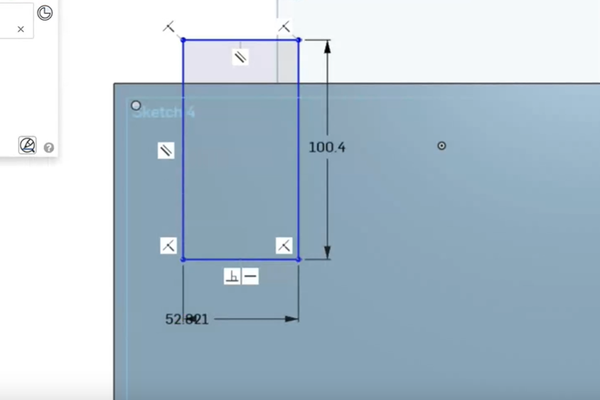
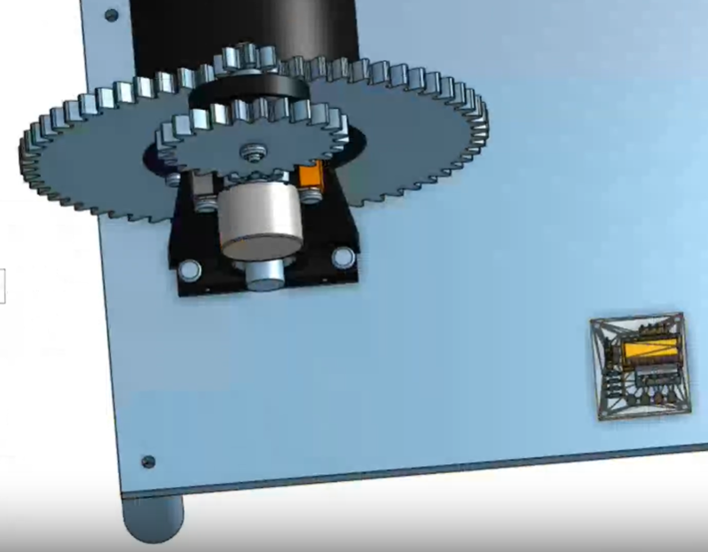

# Devlog 7
1h 0min 22sec Logged 

I found more files for more of the electronics I used online. One of them, the breadboard, was able to be rendered by Onshape, and it looks fine. The other, the OLED, was not able to be rendered by Onshape, and it is another janky-looking part. I still added them to the assembly. I wanted to add the WAGOs next, but I also wanted to avoid weird files, so I modeled the WAGOs myself. I found the dimensions online and even added fillets to make them look more realistic. I think that I'm pretty good at that, so I think I'll model more parts. In the meantime, the assembly is looking more and more complete every Devlog! You can find the files in the 4th-CADs branch. 

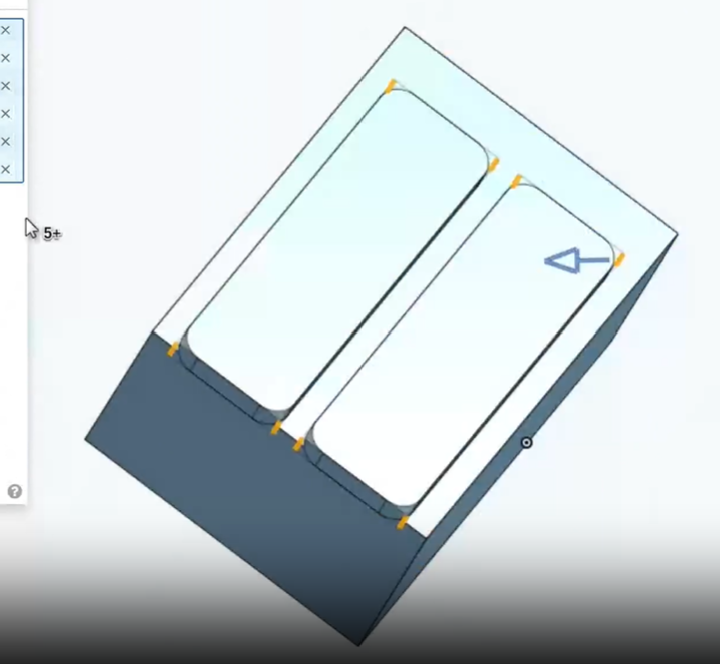
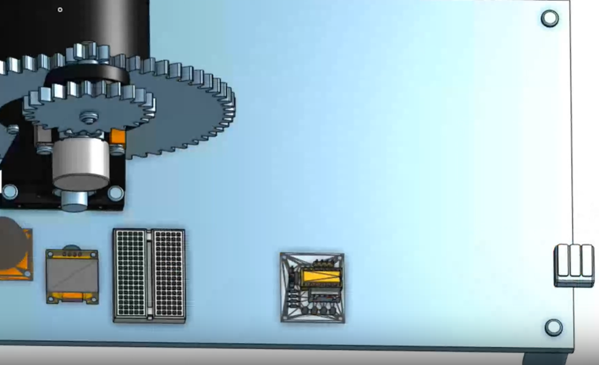

# Devlog 8
2h 53min 17sec Logged 

Oh, boy! I really locked in for this CAD session! I modeled the rest of the components, by myself!I modeled the relay, the 12V-5V buck converter, the l-bracket, the CR-10 heat block, and I turned the assembly into a simulation! The l-bracket and CR-10 heat block were easy to model, because I just had search up their dimensions online and translate that into a part studio in Onshape. The relay and 12V-5V buck converter were harder. I had them in real life, so I used a digital caliper to measure the individual parts and model them in Onshape to the best of my ability. I got details like filets and chamfers, and I added extrude removes for USB ports, wire ports, and screw ports. Afterwards, I added all the parts to the assembly, and I finished putting everything together! That wasn't it, though! To see how it would really work, I added gear relationships to the revolve mates of the gears, and I saw Onshape simulating the Upcycler running! I'm ready to build the Upcycler now!

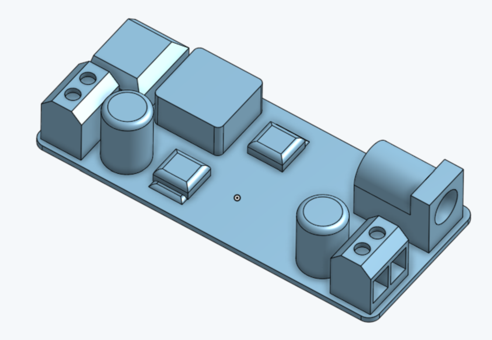
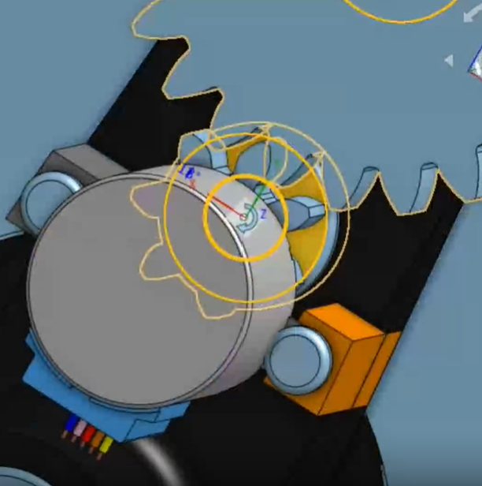
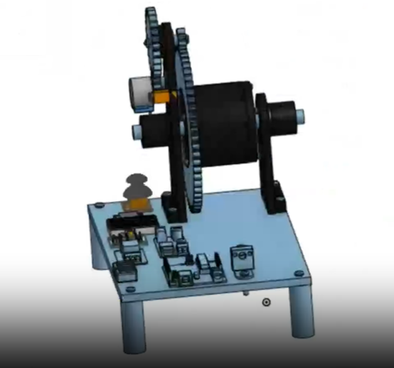

# Devlog 9
1h 2min 34sec Logged

This was my first building session! First, I drilled four holes at the corners of the wooden base I got to attach the legs. I had printed the legs out beforehand, so I just had to screw them on. Then, I put together the short body. I inserted the bearings, I threaded the M8-1.25 60mm screw, I screwed on a nut, I screwed on the spool cap, and I screwed on a second nut. Afterwards, I put together the axle of the main body. I repeated the same process as the short body, but I used the big gear instead of the spool cap. I then secured the spool body onto the big gear using four #6-32 1in screws. Things are going well so far!

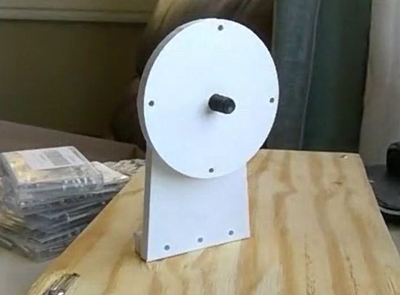
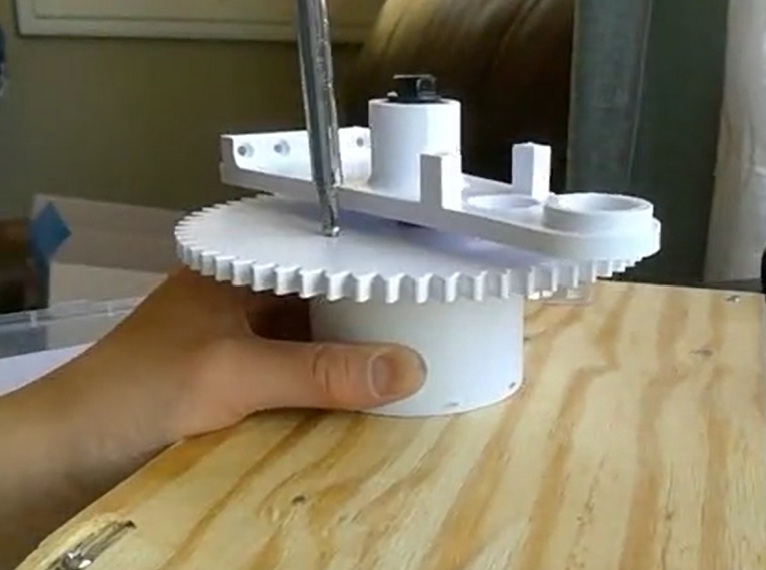

# Devlog 10
1h 6min 37sec Logged

I continued building the Upcycler! I screwed the driven gear and the small gear together using a #8-32 1.5in screw, and after attaching a nut, they can no longer spin independently. However, that was before I screwed the base screws onto the body, and the driven gear got in the way of me doing that, so I had to undo my work, screw in the base screws, and put them back on again. In other news, I attached the spool cap (and the short body) onto the other side of the spool body, making our puller assembly complete! Our 28BYJ-48 stepper motor is ready to go, it just needs the electrical components now, which is what we will be working on next!

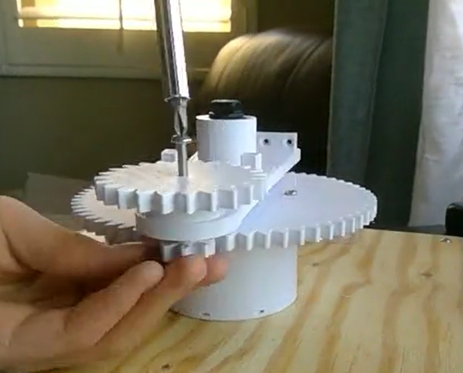
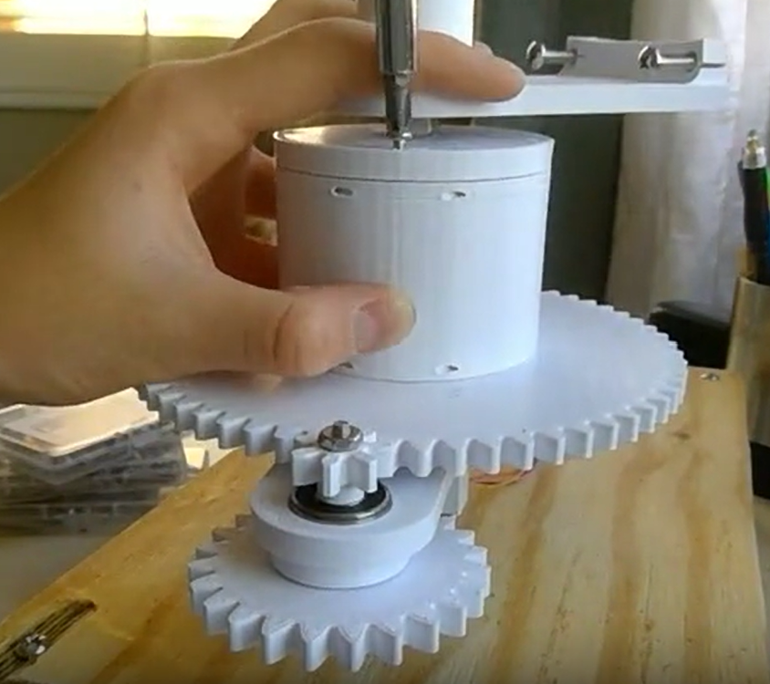

# Devlog 11
1h 45min 52sec Logged

I finsihed building the Upcycler's electrical system today! I drilled the holes in the base for the bodies of the puller assembly, and I slid the bodies into the holes via their screws. On the belly side of the base, I used #8-32 hex nuts to secure the bodies in place. I hot-glued all of the elecrical components in place, and I got all of the wiring done, shy of the heat block. The heating component is the last part I need to finish. In other news, I found the relay I wanted to use too big, so I replaced it with a MOSFET module. I'll redo the CAD on that part next. 

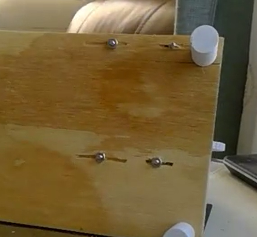
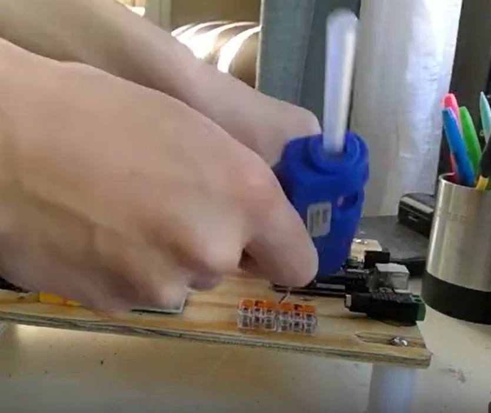
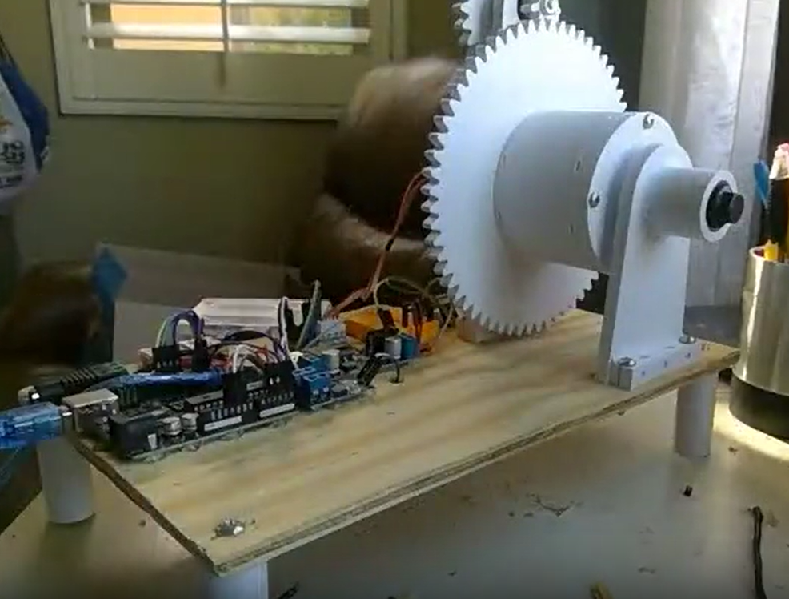

# Devlog 12
0h 37min 57sec Logged

I updated the assembly to have the MOSFET module instead of the relay! I modeled the MOSFET that I used, and I used it to replace the relay in the assembly. This fit a lot easier now. The updated CAD files are in 6th-CADs (branch).

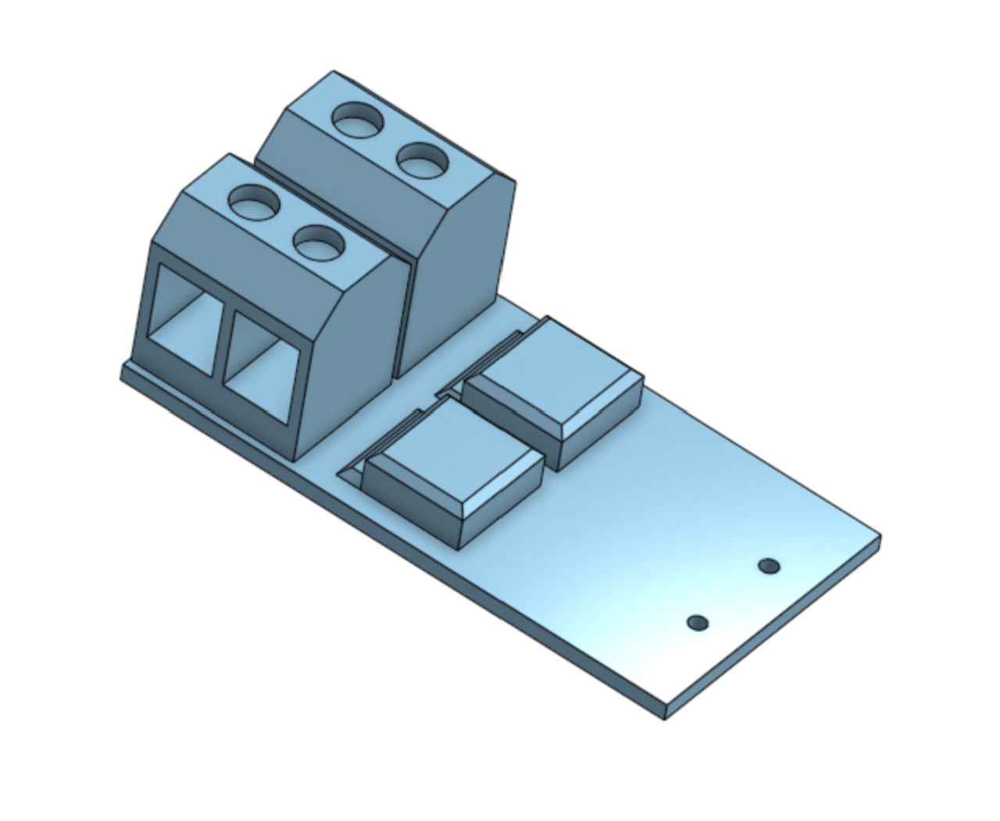
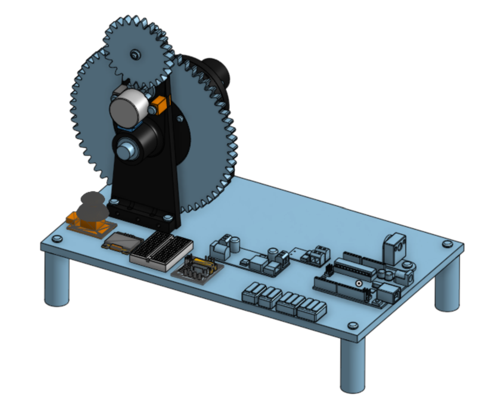

# Devlog 13
49min 20sec Logged

Hi! This is the first devlog for my Upcycler project on Stardance! I started this project in Horizons, but I decided to move over to Stardance after 15 hours of work after seeing how Stardance is more hardware-oriented. To recap the work I did in Horizons, I found a set of 3D files for a body of a Petamentor and adapted them to use a 28BYJ-48 stepper motor. I chose a lot of parts to heat up 7mm strips of PET and control the motor, modeled them on Onshape, bought them in real life, and assembled part of the Upcycler. For this first devlog in Stardance, I started assembling the heating component. I drilled holes in the base to fit the L-bracket that will hold the heat block, and I attached two two-way WAGOs to incorporate a thermistor to track the temperature of the heat block. I added all of the electrical components the thermistor will need. Of course, there is a lot more to my journey than I wrote here. Check out my Github repo to see the entire process (including my work in Horizons!)

