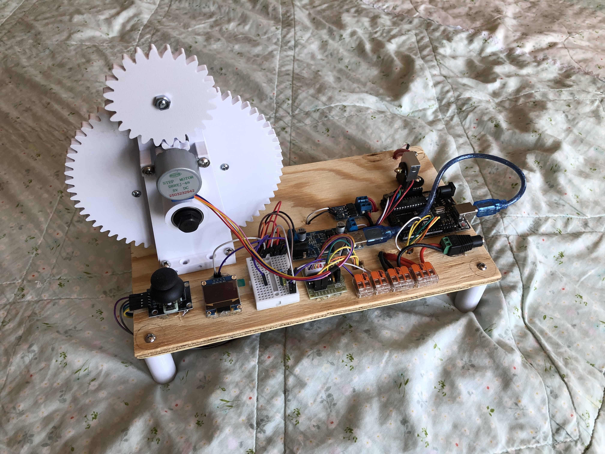

# Upcycler
A machine that turns plastic PET bottles into 3D printing PET filament! 

This is the biggest project I have ever worked on as a middle schooler going into high school. I started this project to reduce plastic pollution, and also to stop wasting tons of money on filament for my voracious 3D printer! I'm making it open source, so you can replicate it (without spending months of time on mistakes!) 

Pros:
- Good for the environment!
- Costs only $50!
- Fun to make!

Cons:
- Threatens to put filament companies out of business!

I hope that my repo helps you replicate my proudest achivement yet! Have fun!

The following are instructions on how to build the Upcycler yourself:

# PARTS TO PRINT

Print these parts however you like to print mechanical components! I like to print them fast with PLA (to save time and money), but print them out of CF if you want to pass your Upcycler onto your great-great grandchildren! The following prices are based of generic PLA prices.

- Main Body x1 (aprox. $0.92)
- Short Body x1 (aprox. $0.62)
- Spool Cap x1 (aprox. $.30)
- Leg x4 (aprox. $0.67)
- Big Gear x1 (aprox. $1.22)
- Small Gear x1 (aprox. $0.04)
- Driven Gear x1 (aprox. $0.23)
- Driver Gear x1 (aprox. $0.07)
- Spool Body x1 (aprox. $0.96)

# Physical Components

These are the parts you might have lying around if you have a 3D printer, or that you may find at Home Depot or Lowe's. Keep in mind that the prices are based off bulk prices I found in those stores. However, most of the pieces are very general-use (like the #6-32 and #8-32 screws) so I'm sure you'll find good use for them ;) 

- Base (cut a 0.3in thick piece of plywood into a 12in x 7in board) x1 (aprox. $1.80)
- Metal L-Bracket (make sure that the diameter of the holes are 6mm, not 5mm) x1 (aprox. $0.23)
- CR-10 Heat Block x1 (aprox $1.25)
- 1/16in Nozzle (use drill and 1/16in attachment to make your own out of any size) x1 (aprox. $0.50)
- #8-32 1.5in Screw x1 (aprox. $0.27)
- #8-32 1in Screw x4 (aprox. $0.40)
- #8-32 0.75in Screw x7 (aprox. $0.63)
- #6-32 1in Screw x8 (aprox. $0.64)
- #8-32 Hex Nut x5 (aprox. $0.45)
- 608 2RS Bearing x7 (aprox. $2.10)
- M8-1.25 60mm Half-Thread Screw x2 (aprox. $2.00)
- M8-1.25 Hex Nut x4 (aprox. $0.72)

# Electronic Components

Oh boy! These aren't parts you'd find walking around your local Micro Center! You may purchase them off your favorite online electronic retailer if you'd like, but if you prefer faster shipping (like me!), all these parts are available on Amazon! (Which is also what their prices are based on).

- ULN2003 x1 (comes with most 28BYJ-48 Stepper Motors)
- 28BYJ-48 Stepper Motor x1 (aprox. $3.00)
- Joystick (any cheap KY-023 clone will work fine) x1 (aprox. $1.67)
- 128x64 OLED x1 (aprox. $2.70)
- 12V 40W Ceramic Heater (get one that's meant for Creality Ender 3 printers) x1 (aprox. $1.40)
- Thermistor (get one that's meant for Creality Ender 3 printers) x1 (aprox. $0.80) 
- 12V-5V Buck Converter (I bought the B0FJM8XTSD, but any such converter that can handle 5A should work) x1 (aprox. $3.50)
- USB Type B (for Arduino Unos) x1 (comes with most Arduino Uno R3's)
- Arduino Uno R3 (I wouldn't buy the real thing, just buy a cheaper clone) x1 (aprox. $7.00)
- 2-Way WAGO x2 (aprox. $0.68)
- 3-Way WAGO x2 (aprox. $0.86)
- Small Breadboad x1 (aprox. $1.00)
- 50V 1uf Capacitor x1 (aprox. $0.40)
- 100k ohm Resistor x1 (aprox. $0.06)
- MTSD001 MOSFET Module x1 (aprox. $1.34)
- 12V 5A Power Supply (buy one that feeds through a jack, and make sure it comes with a female port to plug into that feeds wire connectors) x1 (aprox. $8.00)
- 16 AWG Wire (unspecified amount and cost)
- 22/24 AWG Jumper Wires (unspecified amount and cost)

All parts should run you about $48.43, pre-taxes. 

# Assembly Instructions

Now is the time to put everything together! I'll just go over the order in which you do things, and for attaching all electronic components to the base, just use hot glue and the general layout shown in the picture above.

- Drill 3/16in holes on each of the four corners of the base for the legs
- Screw legs in using #8-32 0.75in screws
- Insert all 7 bearings into all 7 bearing slots
- Insert M8-1.25 60mm screw into the main body's stud bearings: the cap should be on the protruding side
- Use M8-1.25 hex nut to secure said screw in place
- Screw Big Gear onto M8 screw
- Screw another M8 nut onto M8 screw to secure Big Gear in place
- Insert M8-1.25 60mm screw into short body's stud bearings (again, cap should be on protruding side)
- Use M8-1.25 hex nut to secure said screw in place
- Screw Spool Cap onto M8-1.25 screw
- Use M8-1.25 hex nut to secure Spool Cap in place
- Use four #6-32 screws to secure spool body onto the Big Gear
- Secure the Spool Cap (along with the short body) onto the other end of the spool body (using the other four #6-32 screws)
- Screw 2 #8-32 1in screws into the two outermost slots of each body's base
- Drill 4 3/16in holes into the base (two for the main body, two for the short body)
- Slide the two bodies into their slots, and on the belly side of the base, use four #8-32 nuts to secure the screws in place
- Drill a 3/16in hole for the L-Bracket
- Use a #8-32 0.75in screw and #8-32 hex nut to secure the L-Bracket on its hole
- Use the 1/16in nozzle to attach the CR-10 heat block onto the L-Bracket
- Secure the thermistor and the ceramic heater into the CR-10 Heat Block
- Use the USB type B to connect the 12V-5V Buck Converter's USB to the Arduino Uno's big port
- Use two #8-32 0.75in screws to secure the 28BYJ-48 stepper motor onto the main body (with its driver gear attachment attaced)
- Insert the small gear and the driven gear, back to back, into the main body's upper bearing slots. The driven gear goes on the protrusion side, and the small gear goes on the Big Gear side. Use the #8-32 1.5in screw (with a nut) to secure them tightly together, such that they can't spin independently. 

# Wiring Instructions

Alright, now is the time to really lock in. Read all the instructions carefully, because one mess-up WILL fry all your components faster than wanton wrappers in hot oil!

- Connect Arduino 5V and Arduino GND to a 5V and GND rail on the breadboard (duh). Then go ahead and connect all the Vcc's and GND's. You can't possibly screw that up. No components use 3.3V, and expand the rails if need be.
- Joystick VRx goes to Arduino A3
- Joystick VRy goes to Arduino A2
- Joystick SW goes to Arduino D4
- 128x64 OLED SCL goes to Arduino A5
- 128x64 OLED SDA goes to Arduino A4
- Connect each end of the thermistor to one of the two-way WAGO connectors. Then insert a jumper wire with a male end and a bare end into the other slot (for each). Of course, the bare end goes in the WAGO. One of the jumper wires goes straight to GND. The other one goes to its own rail. It will the called the thermistor rail.
- The 50V 1uf capacitor connects the thermistor rail and GND.
- The 100k ohm resistor connects the thermistor rail and the 5V rail.
- A jumper wire connects the thermistor rail and A0.
- Moving on from the thermistor, IN1-4 on the ULN2003 go to Arduino D11-8, respectively.
- MOSFET TRIG/PWM goes to Arduino D5. You may need to solder this connection.
- Use the two 3-way WAGOs and 12V 5A rails. One slot connects the rail to the 12V 5A power supply's wire slot attachment, the other connects the rail to the 12V-5V Buck Converter, and the last slot connects the rail to the MOSFET module. You should be able to figure out + and - in and out, as long as you have more than two brain cells.
- Connect the 12V 40W ceramic heater to MOSFET out(s). 

You have successfully built your very own Upcycler! Feed it 7mm PET plastic strips (around 0.4mm thick) and it'll give you filament to your heart's content!
